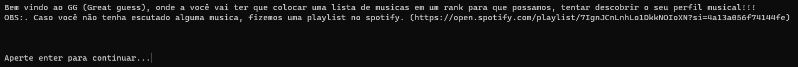
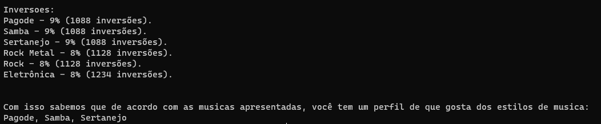
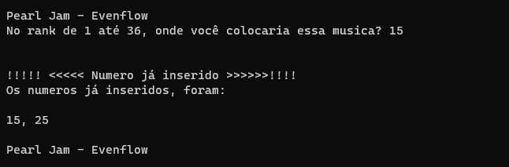

# NomedoProjeto

**Número da Lista**: 1<br>
**Conteúdo da Disciplina**: D&C<br>

## Alunos
|Matrícula | Aluno |
| -- | -- |
| 17/0122549 |  Paulo Gonçalves Lima |
| 17/0113060  |  Pedro Vítor de Salles Cella|

## Sobre 
Trabalho focado em desenvolver um programa que utiliza das inversões para poder descobrir, qual o possivel gosto musical da pessoa, dentro dos perfis musicais cadastrados.   

## Screenshots





## Instalação 
**Linguagem**: Python<br>

## Uso 
Caso queira fazer todo o processo de colocar no rank cada musica, digite apenas:
``` bash
  python3 main
```

Caso queira somente ver o resultado final:
``` bash
  python3 main < input.txt
```


